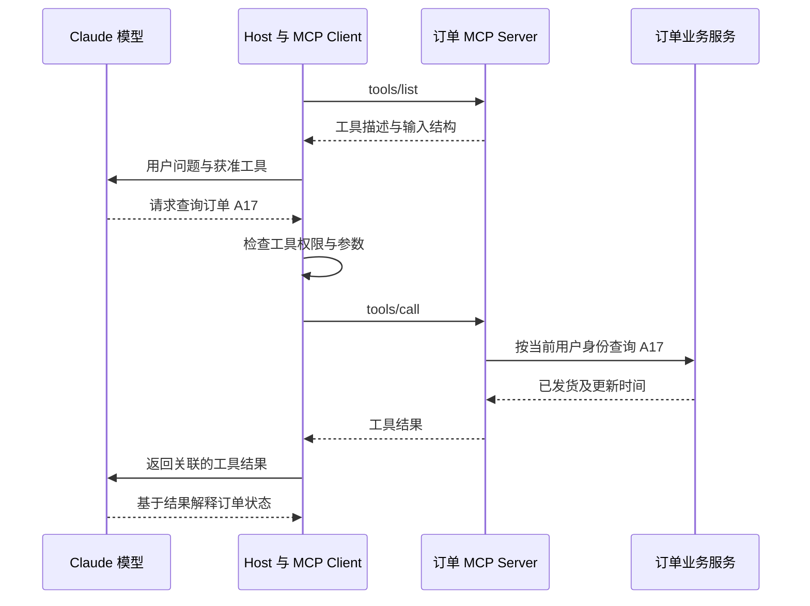

# MCP 架构与使用场景

> 清单 #1 · Domain 3: Integration（19%） · 编写与官方资料核查：2026-09-07
> 考试范围依据：[Exam_Guide.md](../../../Exam_Guide.md) v1.0，第 6 节 Domain 3 的连接协议与集成机制选型要求；题目风格依据第 8 节。
> 本课只完成 MCP 架构与使用场景。API/CLI、agent-to-agent、鉴权、capability bloat 仅作选型边界说明，不代表那些清单项已完成。

## 1. 先建立正确模型

MCP（Model Context Protocol）是 AI 应用接入外部工具和上下文的开放协议。它标准化“有哪些能力、输入是什么、怎样调用、结果怎样返回”，不替你决定业务架构，也不是 Claude 模型本身。[Anthropic 介绍](https://www.anthropic.com/news/model-context-protocol)

假设你已有一个 Java 订单服务：

- 普通 REST API 面向业务消费者，提供查订单等接口。
- MCP server 可以作为适配层，把这些业务能力以 AI 应用可发现、可调用的形式暴露。
- 订单规则、数据权限和真正的数据库操作仍由你的服务执行；不需要把订单系统重写为 LLM 应用。

**为什么需要它？** 多个 AI 应用对接多个系统时，重复编写各自的工具发现、参数映射和调用适配会增加维护成本。公共协议能复用连接层，但不能自动统一各系统的业务语义和权限模型。对于只有一个固定调用的系统，增加这一层未必划算——这是选型判断，不是“新协议一定更好”。

## 2. Host、Client、Server：谁负责什么？

| 角色 | 职责 | 订单助手中的例子 |
|---|---|---|
| Host（宿主应用） | 管理模型交互、上下文和多个 client；执行应用侧的权限与同意策略 | 你的 AI 助手后端或支持 MCP 的 Claude 应用 |
| Client（客户端组件） | 在 host 内与某个 server 通信，处理协议消息 | 订单 MCP client |
| Server（服务端） | 暴露专门的工具、资源或提示模板；可在本机或远端运行 | 调用 Spring Boot 订单 API 的适配服务 |

一个 host 可以管理多个 client；每个 client 对应一个 server。不要误读成“一个远端 server 只能服务一个用户”。远端服务可以承接多个 client。[架构规范](https://modelcontextprotocol.io/specification/2026-07-28/architecture)、[架构概览](https://modelcontextprotocol.io/docs/2026-07-28/learn/architecture)

Server 不需要内置一个模型。Host 也不应为了方便，把完整聊天记录或其他 server 的数据默认交给它；传递完成当前操作所需的最小信息即可。

## 3. 三种服务端能力，不要都叫“工具”

| 能力 | 核心语义 | 本课设计示例 |
|---|---|---|
| Tools | 可调用的操作，有输入结构；操作也可以是只读查询 | `get_order_status(order_id)` |
| Resources | 通过 URI 标识、可读取的上下文数据 | `policy://orders/cancellation` |
| Prompts | 可复用、可参数化的交互模板 | 用户选择“解释订单延迟”模板 |

Resources 不是向量数据库的同义词；它是“怎样提供上下文”的协议抽象。Tool 也不等于“写操作”：搜索、计算、只读查询都可以是工具。[Resources 规范](https://modelcontextprotocol.io/specification/2026-07-28/server/resources)、[Tools 规范](https://modelcontextprotocol.io/specification/2026-07-28/server/tools)

Prompts 常由用户主动选择，而不是自动升级为系统最高优先级指令。旧版规范明确描述这种用户控制的设计意图，但不强制某一种 UI。[Prompts 规范，2025-11-25](https://modelcontextprotocol.io/specification/2025-11-25/server/prompts)

以上是协议概念，不保证所有产品入口都完整支持三类能力。**协议定义、server 实现、client 支持，必须取交集。**

## 4. 一次 Claude 工具调用怎样经过 MCP？

下面是自建 host 的概念流程，不是某个 SDK 的可直接运行代码。建立兼容通信并发现工具以后：

模型提出调用请求，应用运行时负责路由和执行。`tools/list` 发现接口，`tools/call` 执行操作；两者不是同一件事。调用结果还要回到模型交互流程，模型才有依据回答。[架构概览：工具发现与执行](https://modelcontextprotocol.io/docs/2026-07-28/learn/architecture)

本例的设计推理：`order_id` 是定位数据的参数，不是访问该数据的授权凭证。即使模型给出正确订单号，业务层也必须检查此用户能否读取该订单。

## 5. 本地还是远端？先看部署约束

| 传输 | 机制 | 适合场景 | 本课的工程权衡 |
|---|---|---|---|
| stdio | 通过子进程标准输入/输出传递消息 | 本地开发助手接入本机能力 | 不需公开网络入口，但要管理本地程序、运行权限与分发 |
| Streamable HTTP | HTTP 上承载 MCP，响应可为 JSON 或 SSE 流 | 多用户共享远端集成服务 | 易集中维护，但增加网络、认证和服务可用性管理 |

两种传输承载的是 MCP 消息，不是两套业务 API。HTTP 地址可达也不意味着它就是 MCP endpoint；普通 REST endpoint 仍可能需要适配。[当前传输规范](https://modelcontextprotocol.io/specification/2026-07-28/basic/transports)

### 版本提醒：不能把旧教程当成所有版本的行为

- **2025-11-25**：先 `initialize`，再 `notifications/initialized`，然后执行正常操作。[旧版生命周期](https://modelcontextprotocol.io/specification/2025-11-25/basic/lifecycle)
- **2026-07-28**：采用每请求携带版本与能力元数据的无状态协议模型；server 必须实现 `server/discover`，client 可选择先调用它获取能力信息。[当前架构规范](https://modelcontextprotocol.io/specification/2026-07-28/architecture)

无状态协议不等于业务服务不能保存订单、作业或其他业务状态。排查兼容性时先确认双方实际支持的版本，不能把两个版本的握手和消息结构拼在一起。

Guide 没有指定要背诵某个握手版本。这里的变化是实现注意事项，不把它擅自升级为考试重点，也不据此宣称某个 Claude 产品已支持全部新规范。

## 6. 实际 Claude 场景：产品能力与协议能力分开看

截至 2026-09-07，Anthropic 的 **Messages API MCP connector** 文档说明：可直接连接远端 MCP server，省去自行实现独立 client 的工作；该入口目前支持工具调用，不是完整的 tools/resources/prompts 接口。服务需要通过公网 HTTP 暴露，不能直接连接本地 stdio server。当前文档使用 beta 标识 `mcp-client-2025-11-20`。[官方 MCP connector 文档](https://platform.claude.com/docs/en/agents-and-tools/mcp-connector)

对你的 Java 服务，可能有两条路：

1. **自建 host + MCP client**：在你控制的网络中调用 MCP server，再与 Claude API 交互。适合需要控制网络边界、协议支持和编排的情况；代价是自己维护调用循环。
2. **使用上述托管 connector**：在网络与安全政策允许、且只需该入口支持的能力时减少接入代码；代价是接受产品入口的限制。

这是基于文档限制的架构推理。**“远端 connector 不支持本地 stdio”不等于“MCP 不支持本地工具”。** 本地处理也不自动意味着数据不离开本机：若把工具结果发给云端模型，仍需满足数据出口要求。

## 7. 何时采用 MCP，何时暂时不采用？

以下是本课的选型框架，不是官方强制规则。

| 场景约束 | 倾向 | 原因与代价 |
|---|---|---|
| 多个兼容 AI 应用需要复用同一批企业能力 | MCP 适配层 | 复用接口与发现机制；仍需维护兼容性和业务权限 |
| 单一批处理程序，只调用一个稳定 REST endpoint | 直接 API 可能足够 | 需求没有动态发现或多 host 复用，额外适配层收益有限 |
| 需要操作本机文件，host 支持本地 MCP | 考虑 stdio server | 匹配部署边界，但必须约束本机可访问范围 |
| 希望“接上以后检索准确率自然提高” | 不能只靠 MCP | 连接成功与检索质量是不同问题；MCP 不替代 RAG 的数据与检索设计 |
| 需要多个自主 agent 分工、委派任务和汇总结果 | 先设计编排职责 | MCP 可提供能力接入，但连接工具不自动解决任务分工 |

答题时按三步判断：**先找硬约束 → 确认候选方案真的支持所需能力 → 在满足约束的方案中比较维护成本和复杂度。** 不要只因选项写了 MCP、较大模型或“企业级”就选它。

## 8. 最容易踩的失效模式

下表是本课场景化分析；参数校验、访问控制、敏感操作确认、超时和审计的协议安全建议见 [Tools 安全要求](https://modelcontextprotocol.io/specification/2026-07-28/server/tools)。

| 现象 | 优先检查 | 为什么这比调模型更直接 |
|---|---|---|
| server 有某功能，当前 Claude 入口却不能用 | 客户端支持、server 声明、允许的工具集合 | 模型不能补上不存在的接入能力 |
| 连接成功，却能查询其他租户订单 | server/下游的资源级授权 | 通过连接认证，不代表拥有所有数据权限 |
| HTTP 成功返回，助手却把失败操作报告为成功 | 协议错误与工具执行错误是否被区分、传回 | 网络成功不等于业务成功；工具结果可有 `isError` |
| 新接入一个 server 后出现无关的高风险操作 | 是否暴露了当前角色不需要的能力 | 去掉无用权限比只添加“请勿使用”的提示更直接 |
| 写操作超时后重复执行 | 业务幂等键、执行状态、重试策略 | 未收到响应不证明副作用没发生；不能无条件重试 |

最后一项属于分布式系统设计推理：MCP 连接层不是业务事务或 exactly-once 保证。今天只理解这个边界，不展开完整幂等设计。

## 9. 考前自检与资料状态

不看正文，试着回答：

1. 为什么 MCP server 可以只是现有 Java 服务的适配层，而不包含模型？
2. 一个 host 连两个 server，需要怎样的 client 关系？
3. 为什么“查订单”可以是 tool，即使它没有写入副作用？
4. 为什么一个支持 MCP 的产品入口不一定能读取 MCP resource？
5. 在什么约束下你会保留直接 API，而不增加 MCP？
6. 为什么 server 验证身份之后，还必须验证订单访问权限？

能解释上述原因后，再做 [questions.md](questions.md)。

**核查范围**：仅官方 Anthropic 与 MCP 资料；未使用社区备考文章决定范围，未引入模型价格、上下文长度或具体模型型号假设。当前规范与旧版规范分别标注日期。

**Needs verification**：具体部署的 host/SDK 对 `2026-07-28` 的兼容性必须部署前验证；本课没有声称已实测任何 SDK 或执行真实 API 请求。概念流程不是运行测试。本课题目不依赖未验证的 SDK 兼容性。
