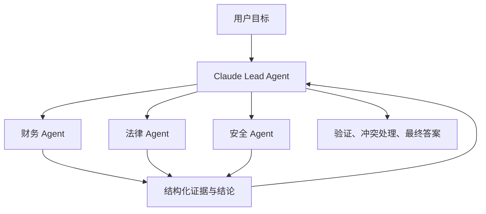

# Agent-to-Agent 通信模式

> 清单 #2 · Domain 3: Integration（19%） · 编写与官方资料核查：2026-09-08
> 考试范围依据：[Exam_Guide.md](../../../Exam_Guide.md) v1.0，第 6 节 Domain 3 的“选择合适的集成机制（MCP、API/CLI、agent-to-agent）”；同时关联 Domain 1 的多 Agent 编排，但本课不宣称已完成该独立知识点。

## 1. 先分清：工具调用和 Agent 协作不是一回事

Agent 是一个能够围绕目标进行多步判断、调用工具、观察结果并继续行动的运行实体。Agent-to-Agent（A2A，泛指）通信解决的是：**一个 agent 怎样把带有目标和上下文的工作交给另一个有自主执行能力的 agent，并接收状态、补充问题和结果。**

昨天学的 MCP 主要解决 agent/AI application 如何发现和调用工具、资源或提示模板。二者可以组合：采购 agent 通过 agent-to-agent 方式委派给供应商分析 agent；后者再通过 MCP 查询 ERP。

| 调用对象 | 对方的抽象 | 典型契约 | 适合的问题 |
|---|---|---|---|
| Tool/API | 确定性能力 | 操作名、参数、响应 | “查询订单 A17” |
| Agent | 可自主规划的任务执行者 | 目标、约束、完成标准、状态、产物 | “评估三个供应商并给出有证据的建议” |

不要把每个微服务包装成 agent。若行为可明确表达为一个稳定函数，直接 tool/API 通常更简单、可预测、便于测试。只有当被委派方需要独立规划、多步工具使用、领域策略或长时间执行时，agent 边界才可能有价值。

## 2. 四种常见协作模式

这些是架构模式，不要求依赖某个特定协议。

### 2.1 Orchestrator–worker（编排者–工作者）

Lead agent 分解目标、分配子任务、收集结果并负责最终答案；worker agent 在清晰边界内独立执行。这是 Anthropic Research 系统公开采用的模式。[Anthropic 工程文章](https://www.anthropic.com/engineering/multi-agent-research-system)

适合：任务可以拆为相对独立的工作包，需要统一责任人和最终综合。例如迁移评估由安全、数据、成本三个专门 agent 分析。

权衡：控制与可审计性较好，但 orchestrator 可能成为质量和吞吐瓶颈。模糊委派会导致重复工作和遗漏；Anthropic 的经验是为 worker 提供目标、输出格式、工具/来源要求和清晰边界。

### 2.2 Parallel fan-out / fan-in（并行分发/汇总）

多个 agent 并行处理独立维度，随后由一个汇总者合并、去重、解决冲突。它通常是 orchestrator–worker 的执行方式，而不是完全不同的组织模型。

适合：子任务相互独立、价值足够高且延迟重要。Anthropic 的研究场景利用独立上下文和并行搜索扩大覆盖面；其公开经验也指出，多 agent 会显著增加 token 消耗，不适合高依赖、必须共享同一上下文的任务。

失败点：把有先后依赖的任务强行并行；多个 worker 重复研究；汇总者无法识别证据冲突；慢 worker 拖住整个批次。应定义分片原则、截止时间、部分成功策略和证据/置信度格式。

### 2.3 Sequential handoff（顺序交接）

一个 agent 完成阶段性工作，再把结构化产物和控制权交给下一个 agent。例如需求分析 → 架构审查 → 合规审查。

适合：明确的阶段依赖、不同权限域或审批边界。优势是职责清楚；代价是延迟累积，而且上游错误会传播。交接内容应包含原始目标、已验证事实、假设、未决问题、约束和产物引用，不能只传一段压缩得含糊的自然语言摘要。

### 2.4 Peer collaboration（对等协作）

多个 agent 可以相互请求、协商或修正，而不是由唯一 lead 统一调度。适合真正需要动态协商、没有固定分解路径的场景。

它的自由度最高，协调风险也最高：循环委派、重复工作、责任不清、状态冲突和不可控成本更难治理。生产系统通常仍需要确定性的外层控制面，例如任务预算、最大轮次、唯一任务 ID、权限策略和终止条件。若问题能用层级编排解决，不应只为“更 agentic”而选对等拓扑。

## 3. 一个好的委派契约

把 agent 调用理解成“语义更丰富的远程任务”，而不是随便发一句聊天消息。至少定义：

| 字段 | 要回答的问题 | 示例 |
|---|---|---|
| Objective | 到底要完成什么？ | 比较供应商 A/B/C 的数据驻留风险 |
| Scope / non-goals | 做什么、不做什么？ | 只分析 EU 数据；不提出最终采购决定 |
| Inputs & provenance | 输入来自哪里、是否可信？ | 合同版本、来源 URL、检索日期 |
| Constraints | 权限、时间、成本、合规边界？ | 禁止传出 PII；10 分钟截止 |
| Output schema | 怎样让下游可靠解析？ | 风险、证据、置信度、未决项 JSON |
| Success criteria | 怎样算完成？ | 每项结论必须引用合同条款 |
| Correlation | 如何关联一次请求、任务和重试？ | `taskId`、`contextId`、trace ID、idempotency key |
| Failure contract | 超时、拒绝、部分成功怎样表达？ | 明确状态及可重试性，不伪装为空结果 |

结构化输出提高可验证性，但不保证语义正确。Orchestrator 仍需验证 schema、来源、权限和完成标准。

## 4. 同步、流式还是异步？

| 模式 | 适用条件 | 主要风险与控制 |
|---|---|---|
| 同步 request/response | 工作短、调用方可以等待 | 超时造成级联阻塞；设置 deadline 和取消语义 |
| Streaming | 需要增量状态或中间产物 | 不能把“有进度”误判为完成；区分 status 与 artifact |
| 异步 task | 工作长、可能需要人工输入或断点恢复 | 必须持久化状态、支持查询/通知、处理重复投递 |

不要用 transport success 判断 task success。HTTP 200 可能只表示任务已接受；最终状态仍可能是 failed、rejected 或 canceled。重试前要判断：请求是否已被接受、动作是否有副作用、是否有幂等键，以及能否按 task ID 查询原任务。

## 5. A2A Protocol：一种标准实现，不等于整个考点

截至 2026-09-08，A2A Protocol 官方规范列出的最新发布版是 1.0.0。它面向彼此独立、内部实现可保持 opaque 的 agent 系统，支持能力发现、任务管理、消息/产物交换以及同步、流式和异步交互。[A2A 规范](https://a2a-protocol.org/latest/specification/)

核心概念：

- **Agent Card**：描述 agent 身份、endpoint、skills、能力与认证要求的元数据。
- **Message**：一次交互内容；适合立即完成、无需任务状态的交流。
- **Task**：带 ID 和生命周期的有状态工作；适合长任务、多轮补充、取消或恢复。
- **Artifact**：任务产生的可交付结果，如文档或结构化数据。
- **contextId**：关联一个共同上下文中的多个 message/task；不能替代访问控制。

官方文档明确区分：MCP 连接 agent 与工具/数据；A2A 连接独立 agent。A2A 本身也不规定一个 agent 如何构建内部 subagent 或如何调用自己的工具。[A2A 与 MCP](https://a2a-protocol.org/latest/)、[核心概念](https://a2a-protocol.org/latest/topics/key-concepts/)、[Task 生命周期](https://a2a-protocol.org/latest/topics/life-of-a-task/)

**重要考试边界**：Exam Guide 写的是泛称 `agent-to-agent`，没有点名 A2A Protocol 或要求背诵其 1.0.0 字段。考试更可能考“什么场景应该委派给 agent、怎样编排、有哪些 trade-off”，而不是纯协议记忆。这里介绍 A2A 是为了展示跨框架、跨团队 agent 的标准化实现选项，不能反推它必然是唯一正确答案。

## 6. Claude 场景的架构推理

一个企业尽调请求可采用：

选择理由：三个维度可并行、各自需要专门工具和判断，最终仍需统一责任人综合。每个 worker 只得到完成自己任务所需的数据和工具权限。

不应采用这个方案的情况：请求只是查一个客户的付款状态；三个 agent 必须不断共享一个巨大的共同状态；或任务价值不足以承担更多 token、延迟、评估和运维成本。此时单 agent + tool、确定性 workflow 或直接 API 更合适。

Anthropic 的公开生产经验表明，multi-agent 对开放式、可并行、跨大量信息的研究有效；但协调复杂度、状态恢复、同步瓶颈和成本都会上升。[Anthropic 工程文章](https://www.anthropic.com/engineering/multi-agent-research-system)

## 7. 安全与信任边界

Remote agent 返回的是不可信输入，即使它通过认证或来自内部团队。调用方应：

- 验证身份、目标 agent 和授权范围；认证不等于有权代表最终用户执行所有动作。
- 最小化委派的上下文、凭证和工具；不要默认转发完整会话或长期 token。
- 对敏感动作设置 policy enforcement 和必要的人类批准，不能只靠另一个 agent 的自然语言承诺。
- 验证 artifact 的 schema、来源、恶意指令和数据分类，再送给下游 agent。
- 贯穿记录 user/request/task/trace 关联，但对日志中的 PII、prompt 和凭证做保护。

A2A 使用标准 Web 安全机制，认证要求可以由 Agent Card 描述，凭证在协议外获取并通过 HTTP header 传递；生产通信使用 HTTPS。部署仍需按组织策略实现资源级授权、密钥生命周期和审计。[A2A 企业实现](https://a2a-protocol.org/latest/topics/enterprise-ready/)

## 8. 典型 failure modes 与处置

| Failure mode | 根因 | 设计处置 |
|---|---|---|
| 重复/遗漏子任务 | 委派范围模糊 | 明确边界、输出 schema、覆盖矩阵 |
| 无限相互委派 | 无预算或终止条件 | 最大深度/轮次/成本、deadline、外层状态机 |
| 错误逐级放大 | 下游结果未经验证即作为事实 | 保存 provenance，逐层验证，最终综合者负责 |
| 单个慢 agent 拖垮全局 | 同步 fan-in 等待所有结果 | deadline、取消、部分结果策略、异步状态 |
| 重试产生重复副作用 | 超时后不知道是否已经执行 | task 查询、幂等键、状态持久化、区分可重试错误 |
| 跨 agent 越权/泄密 | 继承过宽身份或转发过多上下文 | 每次委派单独授权、最小数据、输出校验 |
| 难以解释成本与失败 | 只记录最终答案 | 跨 agent trace、task 状态、委派关系、token/tool 指标 |

## 9. 考试解题框架

遇到集成选型题，按顺序问：

1. 对方是确定性能力，还是能独立规划的 agent？
2. 子任务是否真正可拆、可并行，还是高度依赖共享状态？
3. 谁拥有最终结果、预算、权限和终止决策？
4. 工作是短交互还是需追踪的长任务？
5. 失败、超时、重试、部分成功如何表示？
6. agent 边界是否带来的价值足以覆盖成本、延迟和协调复杂度？

优先选择最直接满足硬约束、责任清楚、权限最小的方案。较大的模型、更多 agent 或更多日志都不能替代错误的边界设计。

## 10. 资料状态

**核查范围**：Exam Guide；Anthropic 2025-06-13 多 Agent 生产工程文章；A2A 官方规范与文档（2026-09-08 查询）。未使用社区备考文章决定考试范围。

**Needs verification**：A2A 的具体协议版本、SDK/API、binding 和产品支持会变化；实施前必须按目标 agent、语言 SDK 和部署环境重新验证。本课没有声称 Anthropic/Claude 的所有产品原生支持 A2A 1.0.0，练习题也不依赖这一未验证假设。
